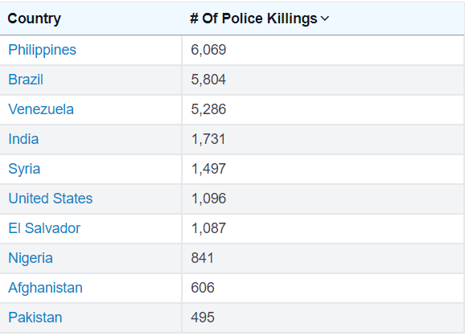

# Module 1: Data Wrangling with Python

## Sprint 4: Capstone Project

## Fatal Police Shooting in the United States (2015-2017)

### Overview

The goal of this project is to analyze the Fatal Police Shootings dataset, between 2015 and 2017. This has been a national issue since the 20th century. The public safety of U.S. citizens is a typical argument to justify the controversially high number of fatal shootings. This analysis is interesting as this is an issue that is common to many countries and some approaches here can probably be applied to other datasets.

According to <https://worldpopulationreview.com/country-rankings/police-killings-by-country>, in 2024 the top 10 Countries with the highest numbers of police killings in the world are:



_(numbers until 25/03/2024)_

### Installation

For the installation purposes and guidance, this project is structured as described below:
| File                                                    | Folder Path                           |  Context                                                                                      |
| ----------------------------------------------| -----------------------------------|---------------------------------------------------------------------------------------------------------|
| _`eda.ipynb`_                                 | _`analytical/`_                    | Main jupyter notebook with the project analysis                                                         |
|      -                                        | _`analytical/assets/data/`_         | To store the datasets to be used in this project (download links available below in this Readme file)   |
| _`functions.py`_                              | _`analytical/assets/utils/`_        | Python file to store the functions to be used in this project                                           |
| _`2024-world-top-10-police-killings.png`_     | _`analytical/assets/data/image/`_  | To show 10 Countries with the highest numbers of police killings in the world in 2024                   |
| _`events_region_usa.html`_                    | _`analytical/assets/data/image/`_  | Map used to present the output from Geopy library, with the cities in USA where the events occurred     |
| _`occur_by_states.png`_                       | _`analytical/assets/data/image/`_  | Map used to show states and occurrences by states. Interactive map if used from IDE                     |

### Project Dataset

The original dataset can be found [here](https://www.kaggle.com/datasets/washingtonpost/police-shootings).

##

#### Data fields explanation (database.csv)

##

| Feature                   | Description                                                           |
| --------------------------| --------------------------------------------------|
| id                        | Record ID                                         |
| name                      | Individual name - Victim                           |
| date                      | Date                                              |
| manner_of_death           | Manner of death                                   |
| armed                     | Type of weapon used by the individual             |
| age                       | Age                                               |
| gender                    | Gender                                            |
| race                      | Race                                              |
| city                      | City of the event                                 |
| state                     | US state                                          |
| signs_of_mental_illness   | If the individual had any signs of mental illness |
| threat_level              | Kind of threat                                    |
| flee                      | Runing away from a place or situation             |
| body_camera               | Police force using a body camera                  |

##

<table>
<tr>
<th><span style="color: #00CCFF;">The key for "gender" is as below:</th>
<th><span style="color: #CCFFFF;">The key for "race" is as below:</th>
<th><span style="color: #00CCFF;">The key for "signs_of_mental_illness" is as below:</th>
<th><span style="color: #CCFFFF;">The key for "body_camera" is as below:</th>
</tr>
<tr><td><span style="color: #00CCFF;">

|Key    | Description |
| ------| ------------|
| M     | Male      |
| F     | Fenale    |

</td>
<td><span style="color: #CCFFFF;">

|Key    |Description |
| ------| -----------|
| W     | White      |
| B     | Black      |
| O     | Other      |

</td><td><span style="color: #00CCFF;">

| Key   |
| ------|
| True  |
| False |

</td><td><span style="color: #CCFFFF;">

| Key   |
| ------|
| True  |
| False |
</td></tr> </table>

##

### Usage

To use this notebook, you can download it and open it with Jupyter Notebook website, or from your IDE, you can install the Jupyter notebook extension and open it from there.

- Important to remember is to upload the dataset file _"database.csv"_ and the additional dataset _"sc-est2019-agesex-civ.csv"_ mentioned on the below topic, along with the _"eda.ipynb"_ file.
- Both datasets must be placed in the _"analytical/assets/data"_ folder.
- The _"eda.ipynb"_ file must be placed in the _"analytical"_ folder.

### Additional dataset used in this project

To enrich the analysis of the primary dataset, an additional dataset was obtained from ```U.S. Census Bureau, Population Division Release Date: June 2020``` source. The original dataset, named ```SC-EST2019-AGESEX-CIV.csv```, provides Annual Estimates of the Civilian Population by Single Year of Age and Sex for the United States and States, covering the period from April 1, 2010, to July 1, 2019.

**Context**

- The reason for using this additional dataset is to understand the whole population in the country, along with the population of the respective states where the fatal shootings occurred.
- Not all the dataset features were used in this project but the intention was to keep them as most original as possible.
- The initial goal was to include the "race" feature, however, this attribute was not available on this source. For other sources, this feature was split into several different categories such as "two or more races" or other as a "race". So it would not be possible to include them and analyze them along with the goal dataset of this project. Or adittional steps would be needed to adapt the races described in the other datasets to this one.

Anyway, a cleaning process will be carried out to keep only the relevant information for this project.

##  

#### Data fields explanation (sc-est2019-agesex-civ.csv)
##

| Feature           | Description                              |
| ------------------| -----------------------------------------|
| SUMLEV            | Geographic Summary Level                 |
| REGION            | Census Region code                       |
| DIVISION          | Census Division code                     |
| STATE             | State FIPS code                          |
| NAME              | State Name                               |
| SEX               | Sex                                      |
| AGE               | Age                                      |
| ESTBASE2010_CIV          | 4/1/2010 civilian population estimates base |
| POPEST2010_CIV           | 7/1/2010 civilian population estimate    |
| POPEST2011_CIV           | 7/1/2011 civilian population estimate    |
| POPEST2012_CIV           | 7/1/2012 civilian population estimate    |
| POPEST2013_CIV           | 7/1/2013 civilian population estimate    |
| POPEST2014_CIV           | 7/1/2014 civilian population estimate    |
| POPEST2015_CIV           | 7/1/2015 civilian population estimate    |
| POPEST2016_CIV           | 7/1/2016 civilian population estimate    |
| POPEST2017_CIV           | 7/1/2017 civilian population estimate    |
| POPEST2018_CIV           | 7/1/2018 civilian population estimate    |
| POPEST2019_CIV           | 7/1/2019 civilian population estimate    |

##
<table>
<tr>
<th><span style="color: #00CCFF;">The key for "SUMLEV" is as below:</th>
<th><span style="color: #CCFFFF;">The key for "REGION" is as below:</th>
<th><span style="color: #00CCFF;">The key for "DIVISION" is as below:</th>
<th><span style="color: #CCFFFF;">The key for "SEX" is as below:</th>
</tr>
</tr><td><span style="color: #00CCFF;">

|Key    | Description           |
| ------| ----------------------|
| 010     | Nation             |
| 040     | State and/or Statistical Equivalent  |

</td><td><span style="color: #CCFFFF;">

|Key    | Description           |
| ------| ----------------------|
| 1     | Northeast             |
| 2     | Midwest               |
| 3     | South                 |
| 4     | West                  |

</td><td><span style="color: #00CCFF;">

|Key|Description|
| ------| ----------------------|
| 1     | New England           |
| 2     | Middle Atlantic       |
| 3     | East North Central    |
| 4     | West North Central    |
| 5     | South Atlantic        |
| 6     | East South Central    |
| 7     | West South Central    |
| 8     | Mountain              |
| 9     | Pacific               |

</td><td><span style="color: #CCFFFF;">

| Key   | Description |
| ------| ------------|
| 1     | Male        |
| 2     | Female      |
</td></tr> </table>

##

### Additional Dataset

To download the original file, please check [here](https://www2.census.gov/programs-surveys/popest/tables/2010-2019/state/asrh/sc-est2019-agesex-civ.csv).

For file layout and methodology statements full information, please check [here](https://www2.census.gov/programs-surveys/popest/technical-documentation/file-layouts/2010-2019/sc-est2019-agesex-civ.pdf).

### Requirements

To proper use this notebook, please install the requirements from the route path, executing the command line as below:

```bash
pip install -r requirements.txt
```

### Dependencies

Also, some functions were developed for code reusability, efficiency and optimization.</br>
To host these functions, a `functions.py` file is used and stored in the `analytical/assets/utils/` path.</br>
They are defined as below:

| Function               | Description                                  |
| -----------------------| ---------------------------------------------|
| `classify_age_bins`    | Used for classifying age into age groups        |
| `get_geocodes`         | Used for getting latitudes and longitudes with Geopy library       |
| `get_year_data`        | Used for getting data for a specific year, considering pre-defined USA States and Age groups      |
| `get_grouped_data`     | Used for grouping data by USA States and Age groups      |
| `plot_percentage`      | Used for Plot the percentage of individual over total population, considering USA States and Age groups        |
| `process_year_data`    | Used for calling all previous functions at once      |

## Code checking

To proper adjust code to be compliant with PEP8, the [pycodestyle_magic](https://github.com/mattijn/pycodestyle_magic?tab=readme-ov-file) was used. To install it, run the following command:

```bash
pip install flake8 pycodestyle_magic
```

### Contributing

Feel free to contribute with comments and suggestions to this project.
